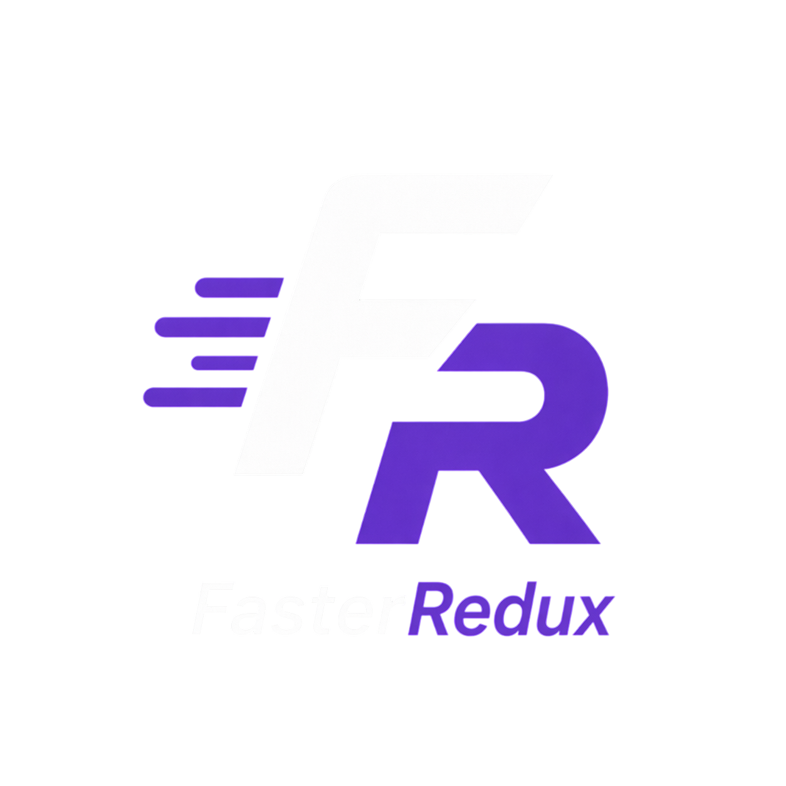

<p align="center">
  
</p>

<h1 align="center">FasterRedux</h1>

<p align="center">
  <b>Мгновенный менеджер-инжектор модов для GTA 5 RP с автоматическим обходом RGL.</b>
</p>

<p align="center">
  
  
  
  
</p>

---

## О проекте
**FasterRedux** — это утилита, написанная на **Go** и **Svelte**, которая позволяет мгновенно (за доли секунды) подменять `.rpf` архивы для обхода проверок файлов в Rockstar Games Launcher (RGL). Создана специально для игроков GTA 5 RP.

### Главные фичи
- **Мгновенная установка Redux:** Вместо долгого копирования файлов используется метод жестких ссылок (NTFS Hardlinks). Подмена происходит моментально.
- **Автоматический обход RGL:** Фоновый мониторинг процесса запуска игры (`GTA5.exe`) и автоматическая подмена файлов уже после проверок лаунчером, но до загрузки самой игры.
- **Современный интерфейс:** Темная тема, стильный дизайн.
- **Работает в фоне:** Сворачивается в системный трей, не мешает играть и потребляет минимум ресурсов процессора.
- **Автозагрузка:** Интеграция в реестр Windows для запуска при старте системы.
- **Менеджер модов:** Переключайтесь между различными сборками в несколько кликов.

---

## Как это работает?
Rockstar Games Launcher проверяет файлы игры на изменения. Если он замечает модифицированный `update.rpf`, он начинает перекачивать оригинальные файлы.
1. При запуске **FasterRedux** оригинальный файл переименовывается в `.bak`.
2. После обнаружения процесса `GTA5.exe`, программа моментально создаёт Hardlink от выбранного модифицированного файла прямо в папку с игрой.
3. Игра успешно запускается с модифицированными файлами. После закрытия игры программа возвращает оригинальные файлы.

---

## Использование
1. Скачайте актуальную версию **FasterRedux.exe** из раздела [Releases](https://github.com/SlateVisionPier/FasterRedux/releases).
2. Запустите программу.
3. Во вкладке "Настройки" укажите путь до папки с игрой (где находится оригинальный `update.rpf`).
4. На главной странице добавьте папки с вашими модификациями в список ("Мои Редуксы").
5. Выберите нужную сборку, нажмите "Применить" и запускайте GTA 5.

Опционально можно включить "Автообход" и "Запуск в фоне" — тогда программа будет работать полностью автономно.

---

## Сборка из исходников
Для самостоятельной сборки потребуется NodeJS, Go 1.20+ и Wails CLI.

```bash
# Клонируем репозиторий
git clone https://github.com/SlateVisionPier/FasterRedux.git
cd FasterRedux

# Собираем exe-файл
wails build -clean
```

Готовый билд появится в: `build/bin/FasterRedux.exe`

---
> Создано для сообщества GTA 5.
